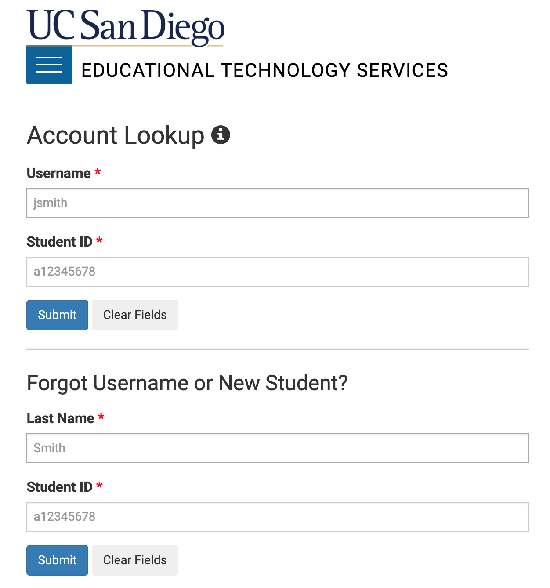
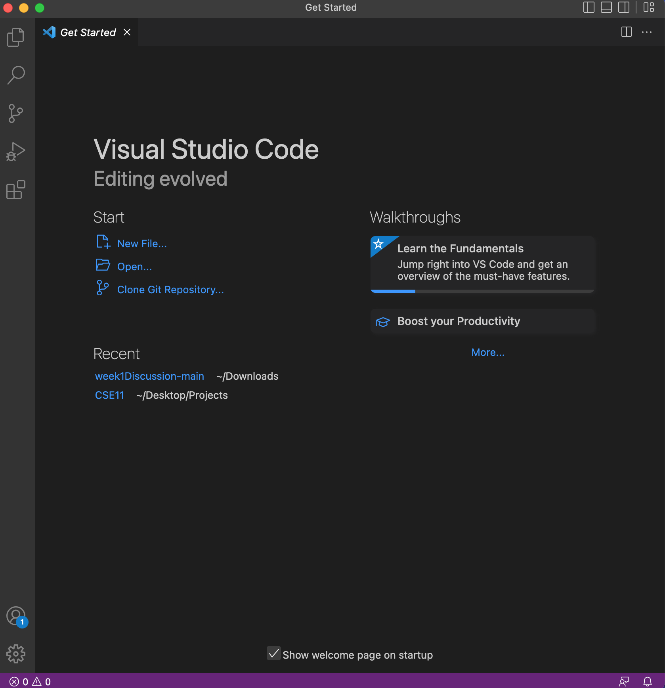
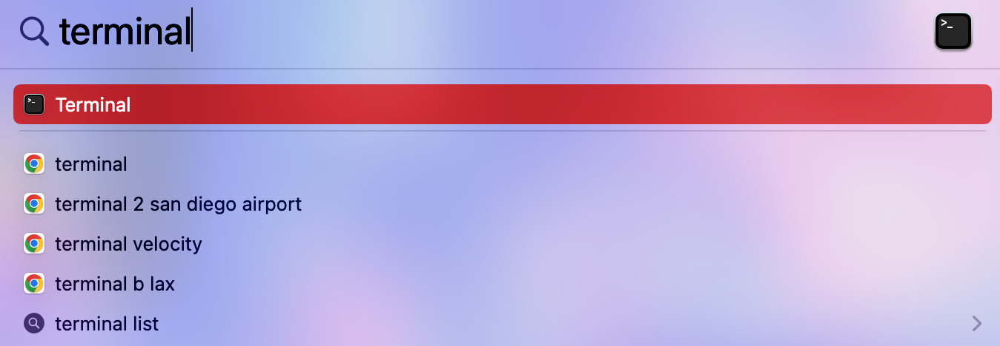
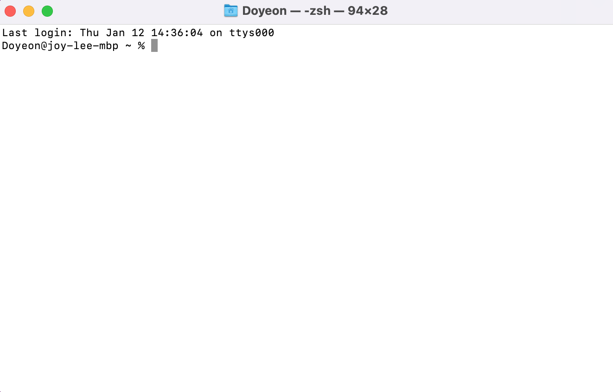
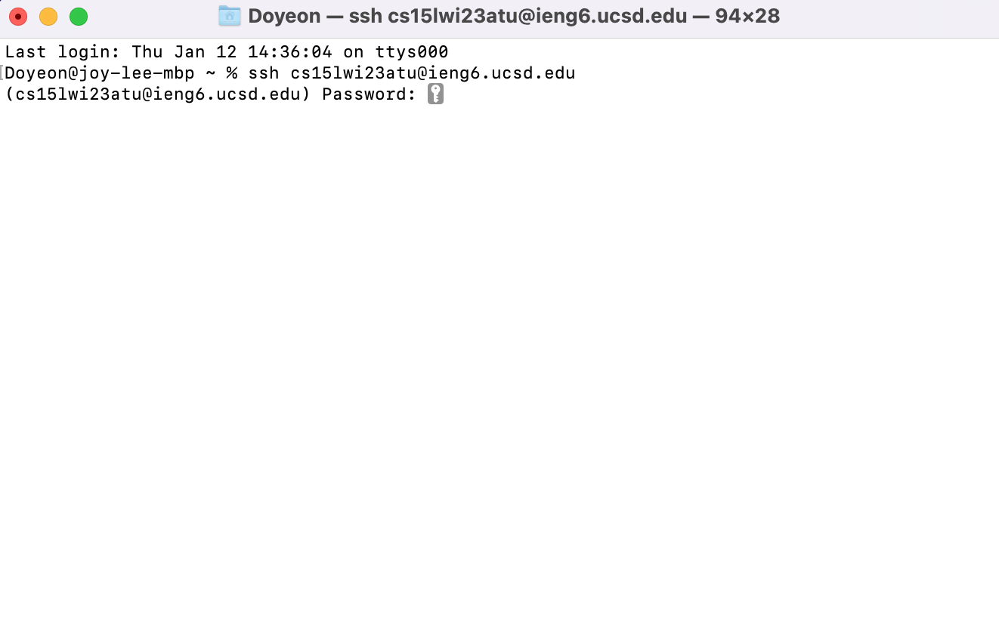
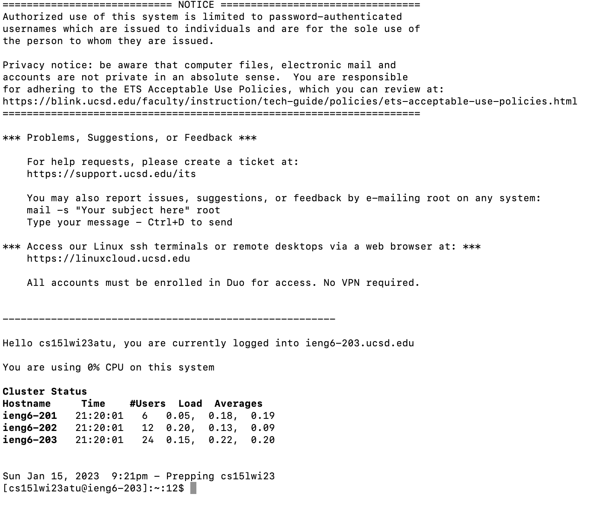
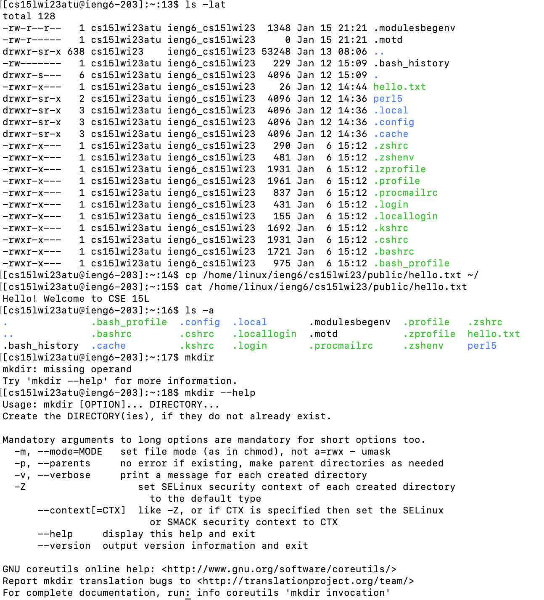
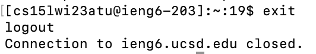

# Lab Report 1
---
CSE15L_WI23_A00 | Joy Doyeon Lee (A17608409) | January 16th, 2023
---
**How to log into a course-specific account on ieng6**

This page is a tutorial for incoming 15L students.

1. Step One

* First, go to look up your account for CSE15L: https://sdacs.ucsd.edu/~icc/index.php
* Make sure to remember your password. We’ll need this later.
* If you forget your password, you can reset the password.
* It will take few minutes to get updated so please take your time.

2. Step Two

* Go to the Visual Studio Code website (https://code.visualstudio.com/)
  and download the versions for your operating system (mine is OSX for Mac).
* If you installed VS Code successfully, you would see this screen.
* It can look different depending on your system and settings.

3. Step Three

* If you are a Mac user like me, you can find a small magnifying glass icon at the top right of the screen.
* Simply select this icon and you can type terminal to open it.

4. Step Four

* When you open the terminal, you would see this screen.
* Now, you type “ssh cs15lwi23xxx@ieng6.ucsd.edu” after % (for Windows, it shows $ instead %).
* Here, you should replace xxx part with your course-specific account.
* If you press the enter, you would see a message asking about the authenticity connection
  and you can say yes.

5. Step Five

* Now, this is time to use your password.
* Type your password on the terminal.
* *In this step, **don’t panic!***
* I was confused whether it was typing or not because I was not able to see any typed letters.
  If you cannot see your typing, that is fine. Keep going!

6. Step Six

* If you got the correct password, you should see this information.
* This means you are currently logged into ieng6-203.cusd.edu.
* You are all set to run the commands.

7. Step Seven

* Time for practice! Try running some commands:
  cd, pwd, mkdir,  ls -lat, ls -a, and cat /home/linux/ieng6/cs15lwi23/public/hello.txt etc.
* Look how each command works.

8. Step Eight

* If you want to log out of the remote server in your terminal,
  you can simply type the command “exit”.
