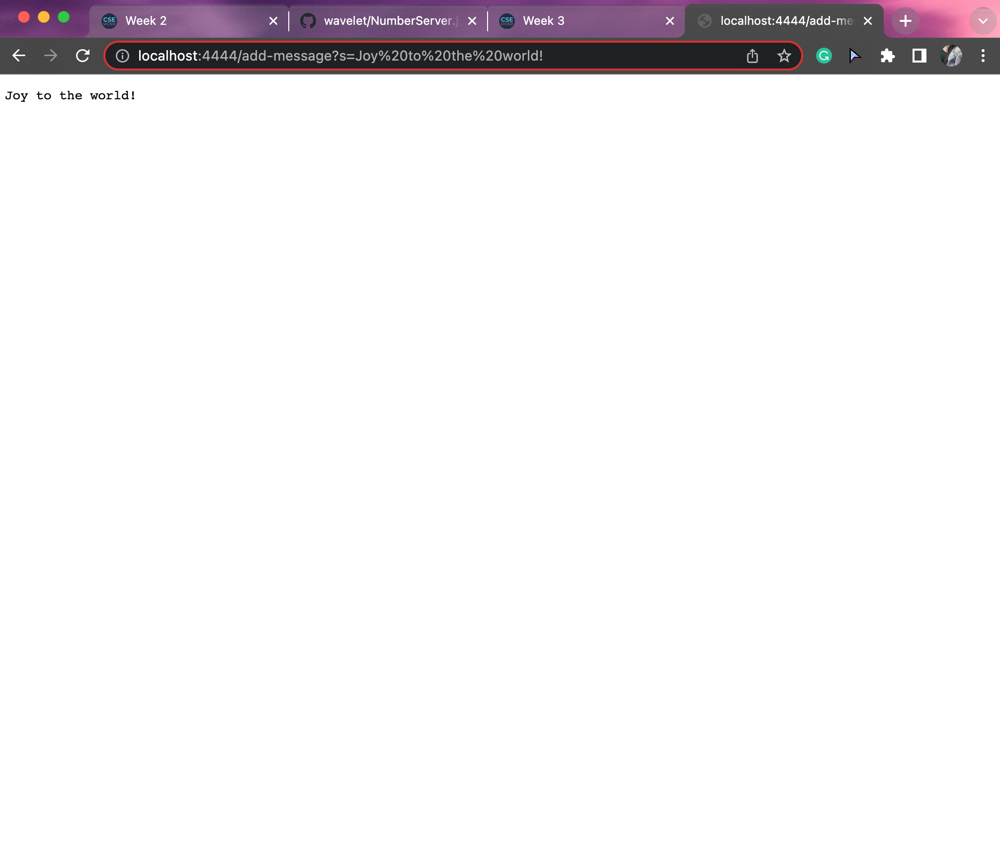
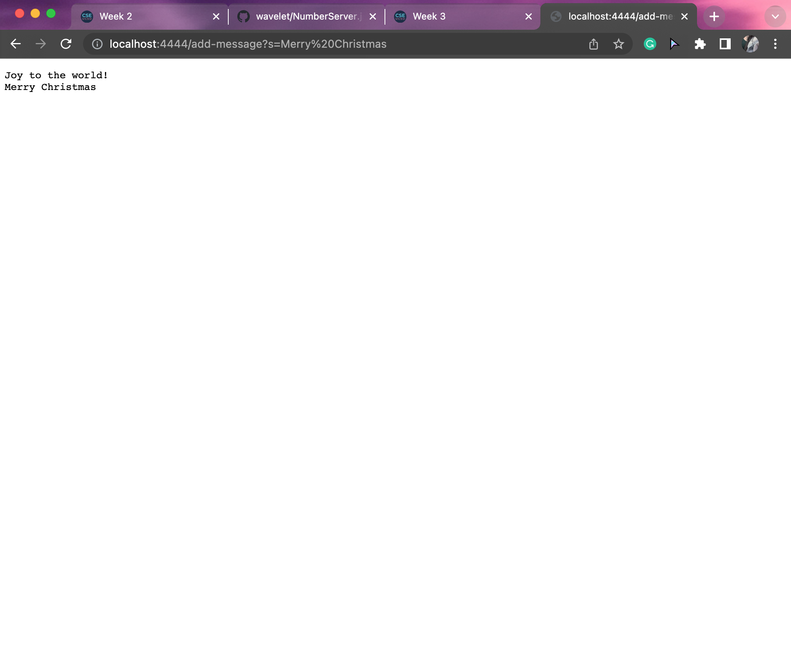
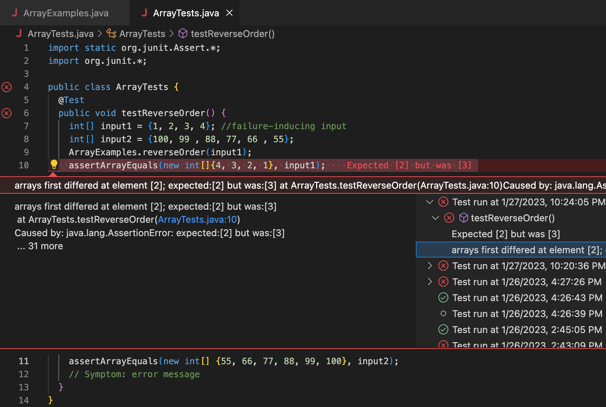

# Lab Report 2
-----
CSE15L_WI23 | Joy Lee (A17608409) | 30 January 2023<br />

-----

###### This page contains three parts below.

---
### <Part 1>

Here is the __code__ for my `StringServer`:

> ```ruby
> import java.io.IOException; 
> import java.net.URI;
> 
> class Handler implements URLHandler {
>    
>     // The one bit of state on the server:
>     // a number that will be manipulated by various requests.
> 
>     String message = "";
> 
>     public String handleRequest(URI url) {
>         if (url.getPath().equals("/")) {
>             return String.format("Joy's message: %s", message);
>         } else {
>             System.out.println("Path: " + url.getPath());
>             if (url.getPath().contains("/add-message")) {
>                 String[] parameters = url.getQuery().split("=");
>                 if (parameters[0].equals("s")) {
>                     if (message.isEmpty()) {
>                         message = parameters[1];
>                     } else {
>                         message = String.format("%s\n%s", message, parameters[1]);
>                     } return message;
>                 }
>             }
>             return "404 Not Found!";
>         }
>     }
> }
> 
> class StringServer {
>     public static void main(String[] args) throws IOException {
>         if(args.length == 0){
>             System.out.println("Missing port number! Try any number between 1024 to 49151");
>             return;
>         }
>         int port = Integer.parseInt(args[0]);
>         Server.start(port, new Handler());
>     }
> }
> ```


* `StringServer.java` shows you the messages you type in your url.
* It also __stores__ the messages you type in the url, so then it shows you all messages you typed.



1. The method `handleRequest` is called to return `Joy to the world!`
2. The relevant argument to this method is url,<br />
   message is the value of the relevant field of the class.
3. message variable is declared as "" which means empty.<br />
   It shows `Joy to the world!` since I typed Joy to the world after `?s=`



*Like the message1 above, it has the similar answers for the first two questions.*
1. Since the code stores your previous message,<br />
   the method `handleRequest` is called to return `Joy to the world!` and `Merry Christmas` both.
2. The relevant argument to this method is url,<br />
   message is the value of the relevant field of the class.
3. message is added since I typed `Merry Christmas` after `?s=` instead `Joy to the world!`<br />
   The code stores the previous message you typed and this is why it shows `Joy to the world!` and `Merry Christmas` in this order.


---
### <Part 2>
  
*I used the provided file `ArrayExamples.java` and `ArrayTests.java` to complete the Part2.*<br />
*I changed the methods' names but code flows are the same.*
  
* In `ArrayExamples` class, there is a method called `reverseOrder(int[] arr)`.
* The way this method works is to change the input array to be in reversed order.
  
* In `ArrayTests` class, I set up a tester using JUnit called `testReverseOrder()`<br />
* This tester checks if the method `reverseOrder(int[] arr)` in the class `ArrayExamples` works or not.
  
  
* The __tester code__ in `ArrayTests` class:
> ```ruby
> import static org.junit.Assert.*;
> import org.junit.*;
> 
> public class ArrayTests {
>    @Test
>    public void testReverseOrder() {
>      int[] input1 = {1, 2, 3, 4};
>      ArrayExamples.reverseOrder(input1);
>      assertArrayEquals(new int[]{4, 3, 2, 1}, input1);
>    }
>  }
> ```
  
* The __original given code__ in `ArrayExamples` class:
> ```ruby
> public class ArrayExamples {
>  static void reverseOrder(int[] arr) {
>    for(int i = 0; i < arr.length; i += 1) {
>      arr[i] = arr[arr.length -i - 1];
>    }
>  }
> }
> ```
  
  
* When you run `testReverseOrder()`, you will see `reverseOrder(int[] arr)` **does not work**!!!


* As you can see, it occurs a bug and shows you an error message as a symptom.
* `int[] input1 = {1, 2, 3, 4};` this part is a failure-inducing input
* `assertArrayEquals(new int[]{4, 3, 2, 1}, input1);` this part shows you an error message.
* The error messages said it is caused by `java.lang.AssertionError` since expected value and actual value are different.

* To __fix the bug__, I fixed the for loop in `reverseOrder(int[] arr)`: *this code does not make an input as a failure-inducing input.*
  
> ```ruby
> public class ArrayExamples {
>   static void reverseOrder(int[] arr) {
>     for (int i = 0; i <arr.length/2; i++) {
>       int temp = arr[i];
>       arr[i] = arr[arr.length -i -1];
>       arr[arr.length -i -1] = temp;
>     }
>   }
> }
> ```

* The difference between the orignial code and fixed code is the for loop.<br />
* The original code occurs a bug because it does not save the current array element to replace it with its new position.
* The fixed code works because it temporarily saves the element and moves the element inside the new index then replace it.

  
  
---
### <Part 3>
* In Week 2, what I learned from the lab is how to make Search Engine and how to show integer/string values; using *localhost:(any port number)/add?s=(any integer or string values)*
* In Week 3, what I learned from the lab is how to get failing inputs, symptoms, and eventually identify the bugs with JUnit tests. I can see the difference between symptoms and bugs through the lab session.
