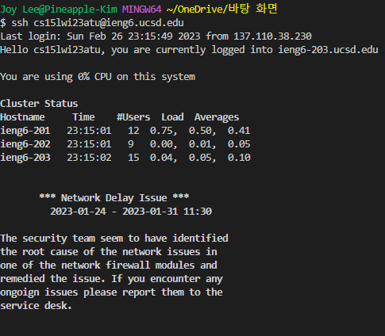
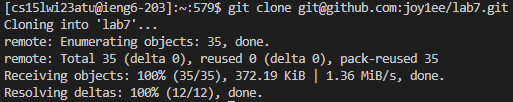
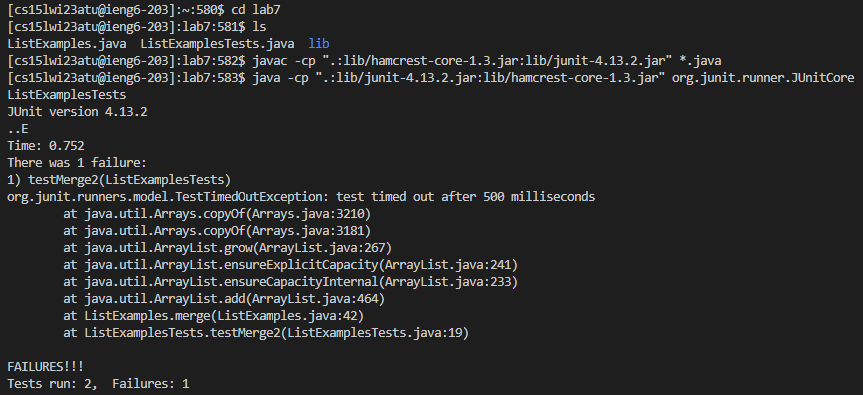
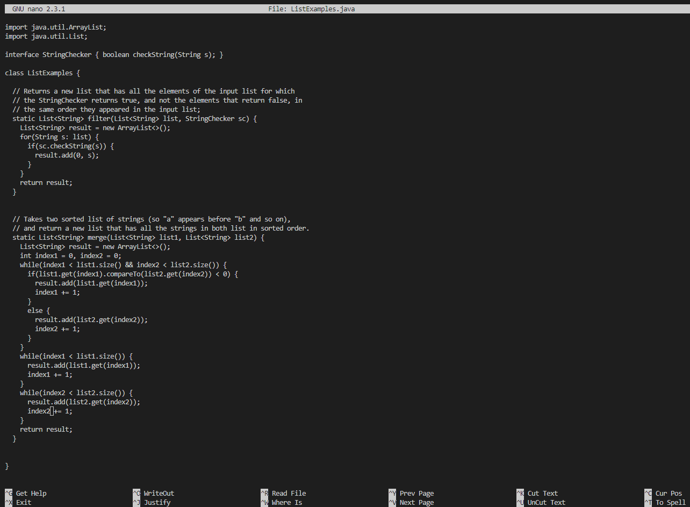
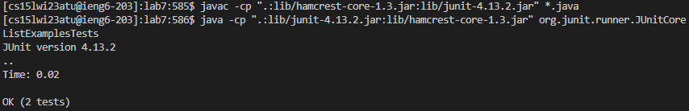
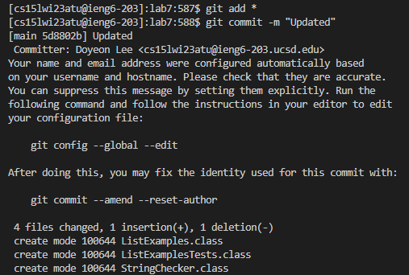
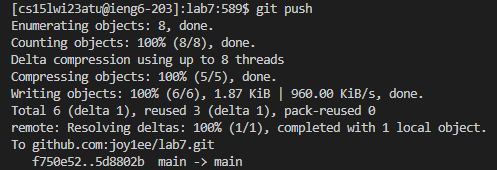
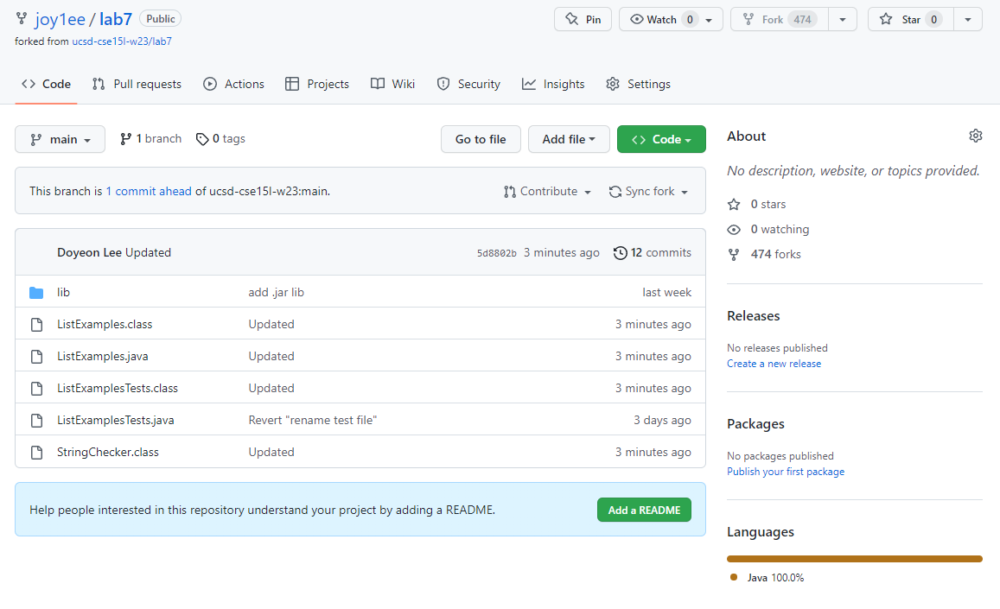

# Lab Report 4

CSE15L_WI23 | Joy Lee (A17608409) | 27 February 2023 

---

###### This page explains step 4 to step 9 on Challenge Tasks.
###### Each step includes screenshots with brief explanation.

---

### Step 4: Log into ieng6

* Type ssh cs15lwi23atu@ieng6.ucsd.edu to log into ieng6. Press <enter>
* As I generated SSH keys for ieng6, I do not need to type the password. 

### Step 5: Clone your fork of the repository from your Github account

* Type git clone and then copy paste my fork of the repository git@github.com:joy1ee/lab7.git
* Press <enter>
  
### Step 6: Run the tests, demonstrating that they fail

* Using <ctrl>+r to search javac in history, I do not need to type long compiler command.
* As above, I used <ctrl>+r to search java in history to run the file.
  
### Step 7: Edit the code file to fix the failing test
* To fix the failing test, type nano ListExamples.java in terminal.

* Down right backspace
* In Line 43, put 2 instead of 1
* To save, I used <ctrl>+o and then press <enter>
* To exit nano, I used <ctrl>+x
  
### Step 8: Run the tests, demonstrating that they now succeed

* To compile and run the file, I used the "up" arrows 3 times to go through the history of commands I have executed.
Key pressed: <up><up><up><enter>

### Step 9: Commit and push the resulting change to your Github account

* Type git add * to add my changes
* Type git commit -m "Updated" to commit the changes
  

* Type git push to push my changes to my Github repository.
  

* They all successfully updated in the Github repository.
